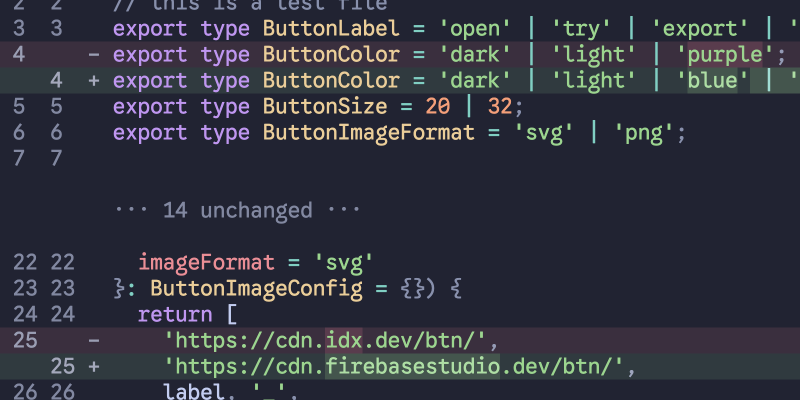
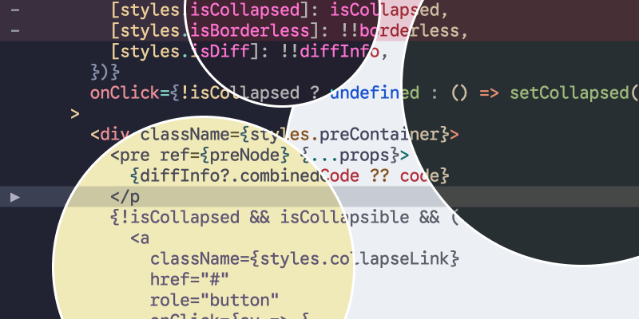

[](https://npmjs.com/package/niftty)
[](https://github.com/romannurik/niftty/tree/main/LICENSE)

# Niftty 🐚



A nifty code syntax highlighter for the terminal, powered by [Shiki](https://shiki.style/).

Niftty is particularly good at:

- Rendering **diffs**, including:
  - Collapsing common regions
  - Highlighting words/characters changed in modified blocks
- **Streaming code** rewrites generated by an LLM

Known limitations:

- Requires a modern, `xterm-256color`-friendly shell.

# Live demo

👉 [**Try the live demo**](https://romannurik.github.io/niftty/).

# Installation

Grab it with your favorite package manager:

```bash
npm install niftty
```

# Usage

```typescript
import { niftty } from "niftty";

process.stdout.write(
  await niftty({
    code: "let foo = 123;",
    diffWith: "let foo = 456;",         // remove to not render a diff
    lang: "tsx",                        // or any shiki language
    theme: "catppuccin-frappe",         // or any shiki-friendly theme
    lineNumbers: "both",                // remove to hide line numbers
    // collapseUnchanged: true          // to collapse common blocks
    // streaming: true                  // if you're streamin' from an LLM
  })
);
```

## API

### `niftty(options: Options): Promise<string>`

Renders a code snippet using [shiki](https://shiki.style/), returning an ANSI-encoded string.

| Parameter | Type | Description |
|-----------|------|-------------|
| `code` | `string` | The code to render |
| `theme` | `shiki.ThemeRegistration \| shiki.BundledTheme` | Named theme or VSCode-compatible theme object |
| `diffWith?` | `string` | Code to diff against for showing additions/removals |
| `lang?` | `shiki.BundledLanguage \| shiki.SpecialLanguage` | Language for syntax highlighting (auto-detected from filePath if not provided) |
| `filePath?` | `string` | File path to help with language detection when `lang` is not specified |
| `collapseUnchanged?` | `boolean \| Partial<CollapseConfig>` | Whether to collapse unchanged lines in diffs |
| `streaming?` | `boolean \| number` | Enable streaming mode for LLM code generation. Number customizes window size |
| `highlighter?` | `shiki.Highlighter` | Reuse a shiki highlighter instance for better performance |
| `lineNumbers?` | `boolean \| "both"` | Show line numbers. Use `"both"` for old and new line numbers in diffs |

# Streaming

If you're building a coding agent and streaming code from an LLM, and want to show that, turn on streaming mode, and feed in the original code (`diffWith` and the partial currently-emitted `code`. Niftty will render an on-the-fly diff.

```typescript
niftty({
  // ...
  streaming: true  // or a number (e.g. 10) for a window of that size
  highlighter: myHighlighter  // re-use a shiki instance
  // ...
});
```

That looks like this:


# Themes

Any VSCode- or shiki-compatible theme should work on modern shells.



# More

Brought to you with 💜 from New York.