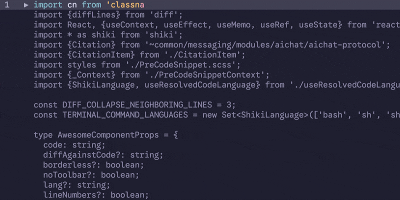

# Niftty 🐚


A nifty code syntax highlighter for the terminal, powered by [Shiki](https://shiki.style/).

Niftty is particularly good at:

- Rendering **diffs**, including:
  - Collapsing common regions
  - Highlighting words/characters changed in modified blocks
- **Streaming code** rewrites generated by an LLM

Known limitations:

- Requires a modern, `xterm-256color`-friendly shell.

# Installation

Grab it with your favorite package manager:

```bash
npm install niftty
```

# Usage

```typescript
import { niftty } from "niftty";

process.stdout.write(
  await niftty({
    code: "let foo = 123;",
    diffWith: "let foo = 456;",         // remove to not render a diff
    lang: "tsx",                        // or any shiki language
    theme: "catppuccin-frappe",         // or any shiki-friendly theme
    lineNumbers: "both",                // remove to hide line numbers
    // collapseUnchanged: true          // to collapse common blocks
    // streaming: true                  // if you're streamin' from an LLM
  })
);
```

# Streaming

If you're building a coding agent and streaming code from an LLM, and want to show that, turn on streaming mode, and feed in the original code (`diffWith` and the partial currently-emitted `code`. Niftty will render an on-the-fly diff.

```typescript
niftty({
  // ...
  streaming: true  // or a number (e.g. 10) for a window of that size
  highlighter: myHighlighter  // re-use a shiki instance
  // ...
});
```

That looks like this:



# Themes

Any VSCode- or shiki-compatible theme should work on modern shells.


# More

Brought to you with 💜 from New York.